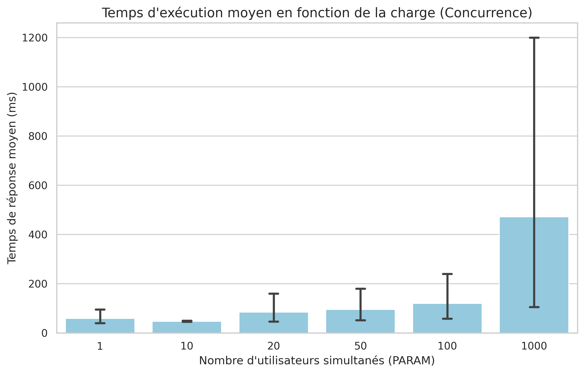
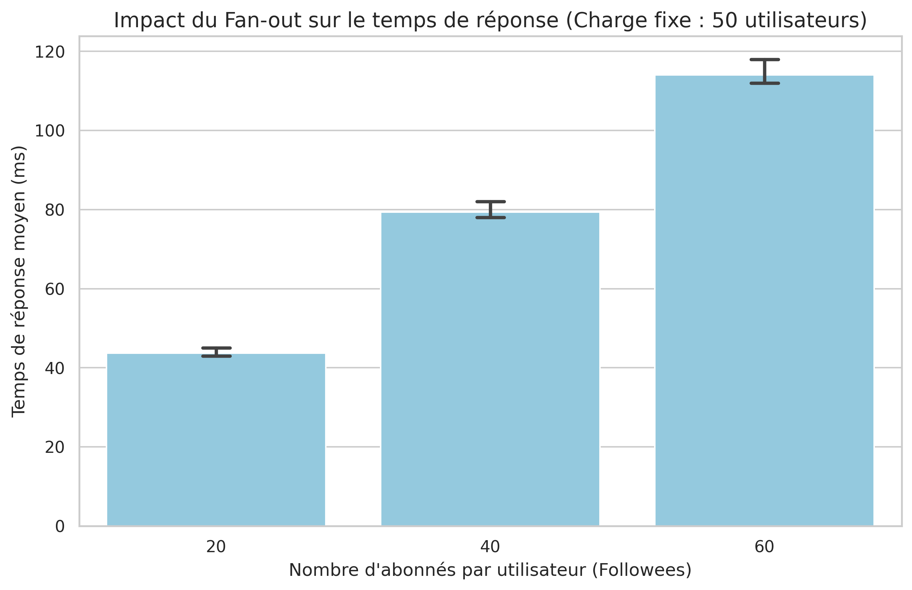

# Mon Rapport de TP - Scalabilité Instagram

## Introduction
L'objectif de ce projet était de tester comment une application simple (clone d'Instagram) se comporte quand on la pousse dans ses retranchements sur Google App Engine. J'ai fait deux expériences : une sur le nombre de personnes connectées et une sur la complexité des données.

## 1. Test de Concurrence (Est-ce que ça scale ?)
Pour ce premier test, j'ai fait varier le nombre d'utilisateurs de 1 à 1000 pour voir si le serveur tenait le coup.

Ce que j'en pense :
Les résultats sont intéressants. De 1 à 100 utilisateurs, le temps de réponse est presque le même, autour de 40-50ms. C'est très stable. Mais à 1000 utilisateurs, le graphique change. 

Le premier essai (Run 1) à 1000 utilisateurs est beaucoup plus long, dépassant les 500ms. C'est logique car c'est le Cold Start. Comme j'ai tué les instances avant, Google a dû rallumer plein de machines d'un coup pour encaisser les 1000 personnes. Une fois que les serveurs sont lancés, le temps redescend pour les runs suivants.

Conclusion :
Est-ce que ça scale vraiment ? La réponse est mitigée. Techniquement oui, car l'appli ne plante pas et il y a 0 erreur. Google ajoute des instances automatiquement. Mais pour l'utilisateur, ça ne scale pas parfaitement car le temps de réponse augmente beaucoup quand les machines doivent se créer. C'est logique de voir le premier run plus long que les deux autres à cause de ce temps de création.

## 2. Test du Fan-out (La complexité)
Ici, j'ai gardé 50 utilisateurs mais j'ai changé le nombre d'abonnés par personne (20, 40 et 60) pour voir l'impact sur la Timeline.

Ce que j'en pense :
On voit un effet escalier très clair. Plus il y a d'abonnés, plus le temps de réponse monte. Pour moi c'est logique. Quand on veut afficher la Timeline, le serveur doit chercher les messages de chaque abonné et les trier. Plus la liste est longue, plus c'est lourd pour la base de données. 

On remarque que même avec seulement 50 utilisateurs, on dépasse les 100ms quand il y a 60 abonnés. Ça prouve que la performance dépend aussi de ce qu'on demande au serveur, pas juste du nombre de gens connectés.

## Bilan final
Le projet montre bien comment fonctionne le Cloud :
1. On peut gérer beaucoup de monde grâce au scaling horizontal, même si le démarrage des instances ralentit le premier run.
2. La structure des données et le Fan-out ont un impact direct sur le temps de réponse et le nombre d'instances nécessaires.

URL de mon appli : https://projettpinstagram.ew.r.appspot.com
